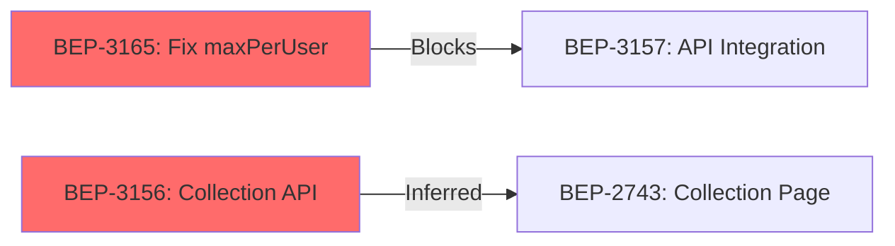

# /dependency-chain

**Role:** Dependency Analyst + Parallel Execution Planner
**Output:** Dependency graph (mermaid) + Critical path + Swim lane plan + Mitigation recommendations

## Workflow

5-phase analysis: Collect → Map → Analyze → Plan → Output

### Phase 1: Collect Sprint Data

Determine scope — sprint ID, issue list, or JQL query:

```text
MCP: jira_search(jql="sprint = <id> ORDER BY rank", fields="summary,status,assignee,issuetype,issuelinks,priority,labels", limit=30)
```

For each item, extract:

- Key, summary, assignee, status, priority
- Issue links (type: Blocks, Relates, Duplicate)
- Size estimate from labels or story points (fallback: infer from issuetype)
- Service tag from summary: `[BE]`, `[FE-Web]`, `[FE-Admin]`, `[QA]`

Load team info:

```text
Read: .claude/skills/shared-references/team-capacity.md
```

**Size defaults** (if no estimate available):

| Type | Default |
|------|---------|
| Bug | S (1.5d) |
| Sub-task | S (1.5d) |
| Story | M (2.5d) |
| Task | M (2.5d) |
| Epic | L (3.5d) |

**Gate:** Data collected — show item count + team members

### Phase 2: Map Dependencies

Build dependency graph from two sources:

**Source A — Explicit (Jira issue links)**

```text
For each item with issuelinks:
  if link.type == "Blocks" → add edge: blocker → blocked (FS dependency)
  if link.type == "Relates" → flag for manual review (may be implicit dependency)
```

**Source B — Inferred (heuristic)**
Analyze items for implicit dependencies not in Jira:

1. **Same API/module**: Multiple tickets touching same endpoint/service → potential merge conflict
2. **FE→BE**: FE ticket references an API from a BE ticket in same sprint → FS dependency
3. **Deploy order**: New FE feature needs new BE endpoint → BE must deploy first
4. **Shared migration**: Multiple DB migrations → must coordinate order
5. **QA→Dev**: QA test plan depends on dev completing feature

For inferred dependencies, mark confidence: HIGH (obvious from context) / MEDIUM (likely) / LOW (possible).

**Output:** Edge list with type and confidence:

```
BEP-3165 ──[Blocks, HIGH]──> BEP-3157
BEP-3156 ──[Inferred:FE→BE, MEDIUM]──> BEP-2743
```

### Phase 3: Analyze Critical Path

Read reference for algorithm details:

```text
Read: ../shared-references/dependency-frameworks.md (section: Critical Path Method)
```

1. Calculate ES/EF for each item (forward pass)
2. Calculate LS/LF for each item (backward pass)
3. Identify critical path (items with zero float)
4. Calculate float for non-critical items
5. Score risks (fan-out, delay impact, team concentration)

**Output tables:**

**Critical Path:**

| Order | Key | Summary | Duration | ES | EF | Assignee | Fan-out |
|-------|-----|---------|----------|----|----|----------|---------|

**Risk Items:**

| Key | Risk Type | Score | Description | Mitigation |
|-----|-----------|-------|-------------|------------|

### Phase 4: Generate Swim Lane Plan

Read reference for scheduling rules:

```text
Read: ../shared-references/dependency-frameworks.md (section: Swim Lane Rules)
```

For each team member, schedule items respecting dependencies:

```
1. Place critical path items first (must start on time)
2. Fill parallel slots with independent items
3. If blocked → assign buffer work (tech-debt, spike, refactor)
4. Apply decoupling patterns where possible:
   - FE blocked by BE? → API Contract First + MSW (see reference)
   - Multiple devs on same module? → Interface-First Development
   - QA blocked by dev? → Start with test plan writing
```

**Present as swim lane table:**

```
| Day | K.Thanainun | joakim | wanchalerm | BIG-TATHEP | Natthakarn |
|-----|-------------|--------|------------|------------|------------|
| 1-2 | BEP-3165    | BEP-XX | BEP-XX     | BEP-XX     | BEP-XX     |
| 3-4 | BEP-3157    | ...    | ...        | ...        | ...        |
```

### Phase 5: Output

Generate final deliverable with 4 sections:

**1. Dependency Graph (Mermaid)**



Use red fill for critical path items, default for others.

**2. Critical Path Summary**

- Total critical path duration: X days
- Sprint duration: Y days
- Buffer: Y - X days
- Risk level: LOW (buffer > 2d) / MEDIUM (buffer 1-2d) / HIGH (buffer < 1d)

**3. Swim Lane Execution Plan**
Per-member daily plan with start/end dates, blocking dependencies noted.

**4. Mitigation Recommendations**
Ranked list of actions to reduce blocking:

```
Priority 1: [Action] — eliminates [N] blocking dependencies
Priority 2: [Action] — reduces delay impact by [N] days
...
```

---

## Options

| Flag | Description |
|------|-------------|
| `--sprint <id>` | Analyze specific sprint (default: current active sprint) |
| `--keys BEP-XX,BEP-YY` | Analyze specific issues instead of full sprint |
| `--team-only` | Show only swim lane plan (skip dependency graph) |
| `--mermaid-only` | Show only mermaid dependency graph |
| `--output jira-comment` | Post result as Jira comment on sprint's first item |

## References

- [Dependency Frameworks](../shared-references/dependency-frameworks.md) — Dependency types, CPM algorithm, decoupling patterns, swim lane rules, risk scoring
- [Team Capacity](../shared-references/team-capacity.md) — Team roster + capacity model
- [Sprint Frameworks](../shared-references/sprint-frameworks.md) — Vertical slicing, carry-over model
