# Mermaid Diagram Guide

> Layout control, best practices, and Confluence-specific patterns

---

## Layout Engines

| Engine | Syntax | Best For | Notes |
| --- | --- | --- | --- |
| **dagre** (default) | No config needed | Simple diagrams (<10 nodes) | Default renderer, good for linear flows |
| **elk** | `%%{init: {"layout": "elk"}}%%` | Complex diagrams with many edges | Requires `@mermaid-js/layout-elk` package — may not be available in all providers (e.g., Confluence Forge plugin) |

### ELK Configuration

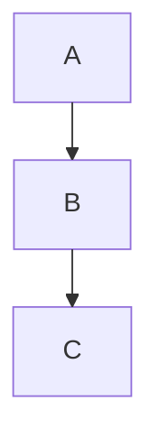

**ELK-specific options** (via init or YAML frontmatter):

| Option | Values | Effect |
| --- | --- | --- |
| `mergeEdges` | `true` / `false` | Combine parallel edges between same nodes |
| `nodePlacementStrategy` | `LINEAR_SEGMENTS` / `BRANDES_KOEPF` | Algorithm for node positioning |
| `cycleBreakingStrategy` | various | How to handle cycles in the graph |
| `forceNodeModelOrder` | `true` / `false` | Respect declaration order for positioning |

---

## Direction Control

### Graph-Level Direction

```mermaid
flowchart TD   %% Top-Down (default)
flowchart LR   %% Left-Right
flowchart BT   %% Bottom-Top
flowchart RL   %% Right-Left
```

**Choosing direction:**

| Pattern | Use Direction | Why |
| --- | --- | --- |
| Linear pipeline | `LR` | Reads like a timeline |
| Hierarchy / tree | `TD` | Parent-child is intuitive top-down |
| State machine with back-edges | `LR` | Back-edges go left (cleaner than going up in TD) |
| Sequence with fallback | `TD` | Happy path down, error branches sideways |

### Subgraph-Level Direction

Each subgraph can override the parent direction:

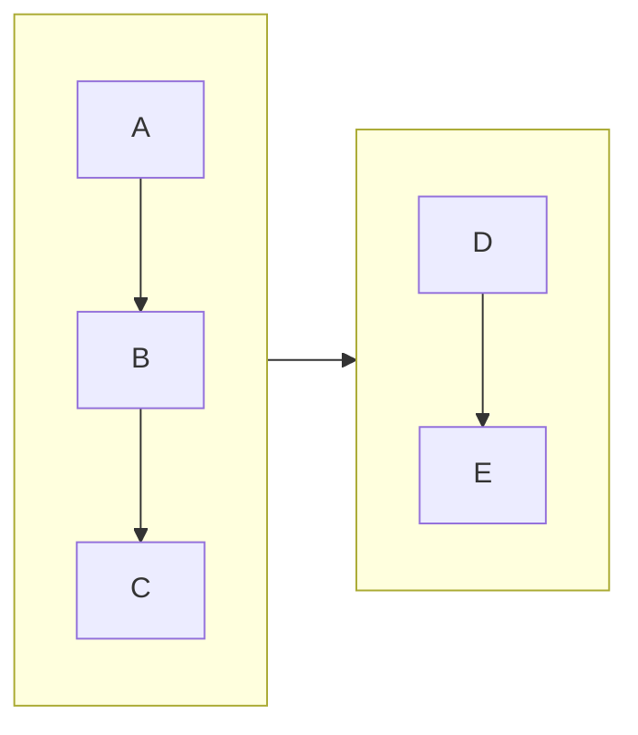

---

## Edge Overlap Solutions

> Edge overlap is a known limitation of Mermaid's dagre engine ([#5060](https://github.com/mermaid-js/mermaid/issues/5060), [#1006](https://github.com/mermaid-js/mermaid/issues/1006))

### Strategy 1: Change Direction (most effective)

If `TD` causes back-edges to overlap, switch to `LR`:

```
TD with back-edges:        LR with back-edges:
  A                          A → B → C → D
  ↓                                ↑     |
  B ←──┐                          └─────┘
  ↓    |                    (left-going = cleaner)
  C    |
  ↓    |
  D ───┘
  (up-going = messy)
```

### Strategy 2: Invisible Subgraphs for Column Layout

Group nodes into invisible subgraphs to force column positioning:

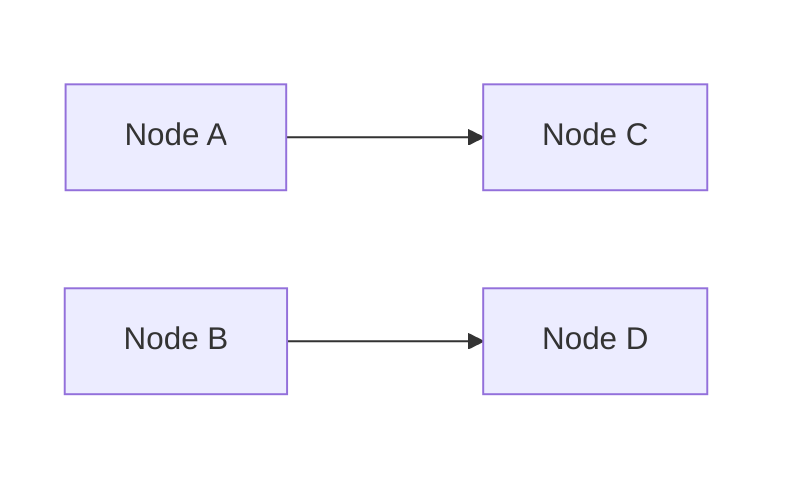

### Strategy 3: Invisible Links for Spacing

Use `~~~` to create invisible connections that influence positioning:

```mermaid
flowchart TD
    A --> B
    A --> C
    B ~~~ C   %% invisible link forces B and C side-by-side
    B --> D
    C --> D
```

### Strategy 4: Node Declaration Order

Dagre positions nodes based on declaration order. Declare nodes in the visual order you want:

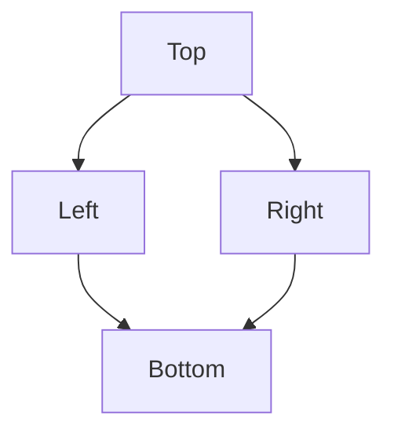

### Strategy 5: Simplify Labels on Back-Edges

Shorter labels on back-edges reduce visual clutter:

```
%% Bad — long label on back-edge causes wide curve
OFFLINE -->|"Reconnect and synchronize data"| ONLINE

%% Good — short label
OFFLINE -->|"Reconnect"| ONLINE
```

---

## Line Break in Node Labels

| Syntax | Renders As | Support |
| --- | --- | --- |
| `<br/>` | Line break | All renderers (recommended) |
| `\n` | Line break | Some renderers only |

**Always use `<br/>` for Confluence** — `\n` may render as literal text in some Mermaid plugins.

```mermaid
%% Good
A["Line 1<br/>Line 2"]

%% Bad (may not work in Confluence)
A["Line 1\nLine 2"]
```

---

## Node Shapes

| Shape | Syntax | Use For |
| --- | --- | --- |
| Rectangle | `A[text]` | Standard state/process |
| Rounded | `A(text)` | Generic node |
| Stadium | `A([text])` | Transient/intermediate state |
| Circle | `A((text))` | Start/end point |
| Small circle | `A(( ))` | Initial state marker |
| Diamond | `A{text}` | Decision |
| Hexagon | `A{{text}}` | Condition/check |
| Database | `A[(text)]` | Data store |
| Asymmetric | `A>text]` | Signal/event |

---

## Link Types

| Type | Syntax | Use For |
| --- | --- | --- |
| Arrow | `A --> B` | Standard flow |
| Open | `A --- B` | Association (no direction) |
| Dotted arrow | `A -.-> B` | Optional/conditional |
| Thick arrow | `A ==> B` | Emphasis/critical path |
| Invisible | `A ~~~ B` | Layout control only |
| With label | `A -->\|"text"\| B` | Labeled transition |

---

## Edge Animation

> **Confirmed working** on Confluence Forge Mermaid plugin v11.12.2 (tested Feb 21, 2026).
> Requires Mermaid 11.x+ (PR [#6136](https://github.com/mermaid-js/mermaid/pull/6136), merged Jan 2025).

### Edge IDs

Assign an ID to an edge by prefixing with `id@`:

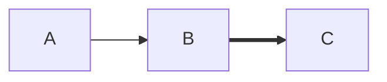

### animate: true (basic)

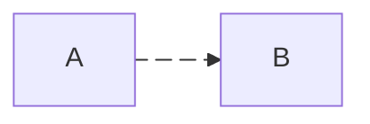

### Animation Speed

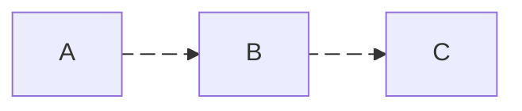

### classDef Custom CSS

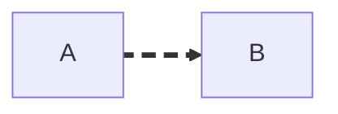

> **Escape commas:** Use `\,` in style values — Mermaid uses `,` as delimiter between styles.

### Mixed (animated + static)

Only edges with IDs + animate metadata will animate. Others remain static:

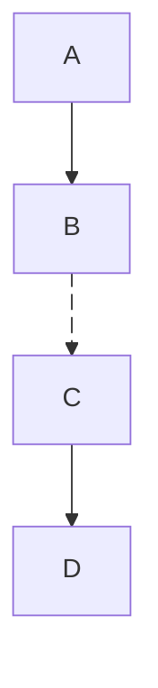

### `&` Syntax Limitation

The `&` shorthand (`D & E e1@--> F`) only assigns the edge ID to **one** of the edges — the other stays static (no animation). Always split into separate edges:

```mermaid
%% Bad — only E→F animates
D & E e1@--> F
e1@{ animation: fast }

%% Good — both animate
D e1@--> F
E e2@--> F
e1@{ animation: fast }
e2@{ animation: fast }
```

### Use Cases

| Pattern | When to Animate |
| --- | --- |
| Data flow | Show direction of data movement (Pusher events, API calls) |
| Critical path | Highlight the hot path in a process flow |
| Real-time events | Indicate live/streaming connections |
| Before/After | Animate "new" edges, keep "old" static |

**Test script:** `scripts/test-mermaid-animation.py` — creates test page on Confluence with 4 animation variants.

---

## Styling

### Node Styles

```mermaid
style NODE_ID fill:#color,stroke:#color,stroke-width:2px
```

### Semantic Color Palette

| State | Fill | Stroke | Hex |
| --- | --- | --- | --- |
| Success / Online | Light green | Green | `fill:#d4edda,stroke:#28a745` |
| Warning / Degraded | Light yellow | Yellow | `fill:#fff3cd,stroke:#ffc107` |
| Error / Critical | Light red | Red | `fill:#f8d7da,stroke:#dc3545` |
| Highlight / New | Gold | Dark | `fill:#ffd700,stroke:#333` |
| Info / Neutral | Light blue | Blue | `fill:#cce5ff,stroke:#004085` |

---

## Confluence-Specific Patterns

### Mermaid on Confluence (Forge Plugin)

Requires **two elements** — see `troubleshooting.md` "Mermaid Diagrams" section for full details.

1. **Code block** (`language=mermaid`) — diagram source
2. **Forge `ac:adf-extension` macro** — renderer

### Programmatic Creation

Reference: `scripts/create-player-architecture-page.py`

```python
# mermaid_diagram(code, page_id) — generates code block + Forge macro
# tracked_code_block() — non-mermaid code blocks (maintains index counter)
# _code_block_count — global counter, reset per page build
```

### Hiding Mermaid Source Code

**`collapse=true` does NOT work on Mermaid code blocks** — the parameter is ignored and source code remains fully visible. Use the **Expand macro** instead.

**Expand macro wraps only the code block** — Forge renderer stays outside so the diagram is always visible:

```xml
<!-- Expand macro (collapsed by default) — hides source code -->
<ac:structured-macro ac:name="expand" ac:schema-version="1">
  <ac:parameter ac:name="title">Mermaid Source</ac:parameter>
  <ac:rich-text-body>
    <ac:structured-macro ac:name="code" ac:schema-version="1">
      <ac:parameter ac:name="language">mermaid</ac:parameter>
      <ac:plain-text-body><![CDATA[flowchart TD ...]]></ac:plain-text-body>
    </ac:structured-macro>
  </ac:rich-text-body>
</ac:structured-macro>
<!-- Forge ac:adf-extension here — OUTSIDE expand, always visible -->
```

**Result:** "▶ Mermaid Source" (collapsed) + rendered diagram always shown below.

**Forge index:** Code blocks inside Expand macros are still counted by `guest-params > index` — tested and confirmed.

**Current convention** (architecture pages): `mermaid_diagram()` automatically wraps code block in Expand macro. TypeScript/JSON pseudocode blocks use `collapse=True` via `tracked_code_block()`.

> Full details: `troubleshooting.md` → "Expand/Collapse Mechanisms in Confluence"

### Known Limitations on Confluence

| Feature | Status | Workaround |
| --- | --- | --- |
| `\n` in labels | May not work | Use `<br/>` instead |
| ELK layout engine | Likely unsupported | Use dagre with layout tricks |
| `%%{init: ...}%%` | Partial support | Test before relying on advanced config |
| Large diagrams (>30 nodes) | May render slowly | Split into multiple smaller diagrams |
| Interactive features (click) | Not supported | Use static labels with links in surrounding text |
| **Special chars in labels** | **ALL diagram types** | `×` `±` `:` (time format) cause Forge parse error. Use ASCII: `x` `+-` `-`. Confirmed on flowchart + gantt. `()` `_` also problematic in gantt task names |
| **Gantt diagrams** | **Works (v11.12.2)** | Additionally avoid `()` `_` in task names |
| **Edge animation** | **Works (v11.12.2)** | `e1@{ animate: true }`, `animation: fast/slow`, classDef CSS — all confirmed working |
| Architecture diagrams | Untested | `architecture-beta` (v11.1.0+) — test before using |
| Packet diagrams | Untested | `packet` (v11.0.0+) — test before using |

---

## Common Diagram Patterns

### State Machine (recommended structure)

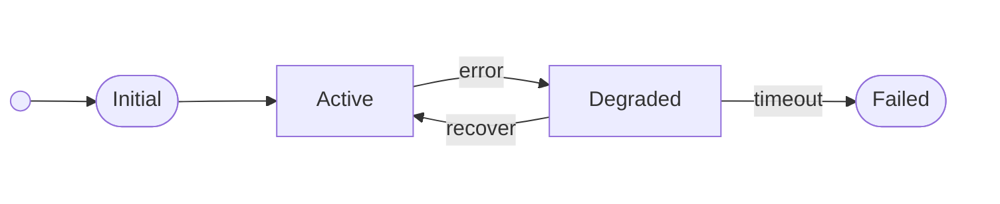

**Key:** Use `LR` + invisible subgraphs for column grouping. Back-edges (recover) flow left naturally.

### Architecture Overview (recommended structure)

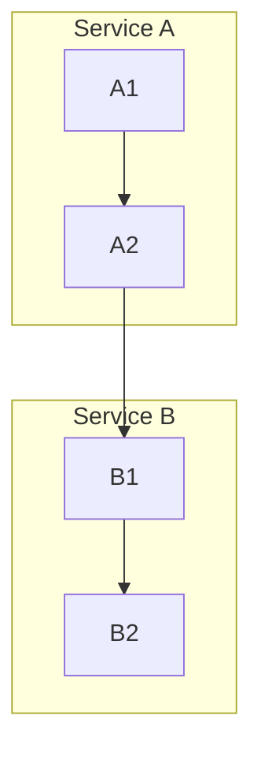

**Key:** Use `TD` with subgraphs per service/layer. Cross-subgraph edges flow downward. Move shared interfaces (API endpoints) to separate subgraphs between layers to avoid back-edges.

### Sequence-like Flow

Use `sequenceDiagram` instead of flowchart for request/response patterns.

---

## Anti-Patterns

| Anti-Pattern | Problem | Fix |
| --- | --- | --- |
| Too many nodes in one diagram | Unreadable, slow render | Split into 2-3 focused diagrams |
| Long labels on edges | Edges become wide, overlap | Short labels; add detail in surrounding text |
| `TD` with many back-edges | Upward curves cross everything | Switch to `LR` |
| Nodes inside wrong subgraph | Cross-subgraph edges create U-turns | Move shared nodes to boundary subgraph |
| `\n` for line breaks | May render as literal text | Always use `<br/>` |
| Hardcoded layout with `~~~` everywhere | Fragile, breaks on content change | Use subgraphs for structural grouping first |
| `&` syntax with edge ID (`D & E e1@--> F`) | Only one edge gets the ID — other stays static | Split into separate edges: `D e1@--> F` + `E e2@--> F` |

---

## Related

- Confluence Mermaid rendering: [troubleshooting.md](troubleshooting.md) → "Mermaid Diagrams" section
- Reference implementation: `scripts/create-player-architecture-page.py`
- Forge macro details: `troubleshooting.md` → Instance IDs table
