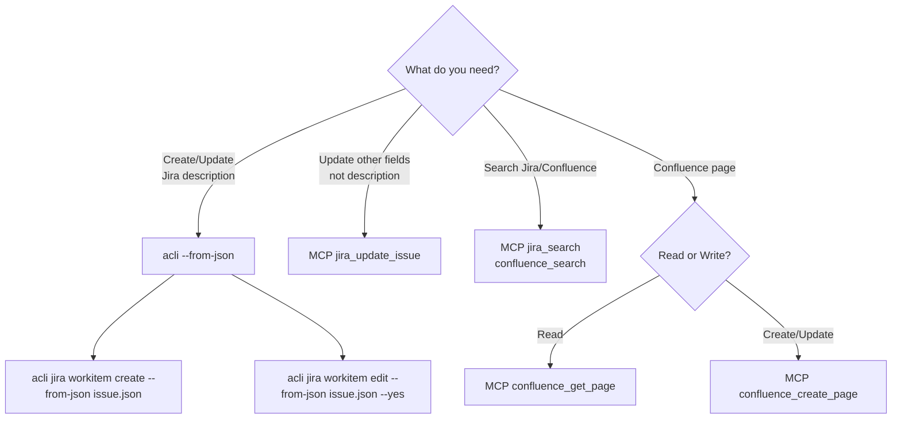

# CLAUDE.md

This file provides guidance to Claude Code (claude.ai/code) when working with code in this repository.

---

## Overview

Agile Documentation System for **Tathep Platform** - Create Epics, User Stories, and Sub-tasks via Jira/Confluence

## Project Settings

| Setting | Value |
| --- | --- |
| Jira Site | `100-stars.atlassian.net` |
| Project Key | `BEP` |
| Confluence Space | `BEP` |

## Quick Start (5 min)

1. **ต้องการสร้าง feature ใหม่?** → `/story-full` (สร้าง Story + Sub-tasks ครบ)
2. **มี Epic แล้ว ต้องการสร้าง Story?** → `/create-story`
3. **มี Story แล้ว ต้องการวิเคราะห์?** → `/analyze-story BEP-XXX`

> ⚡ **หลังสร้างเสร็จ:** ใช้ `/verify-issue BEP-XXX` ตรวจสอบคุณภาพเสมอ

## Skill Commands

### Create (สร้างใหม่)

| Command | Description | Output |
| --- | --- | --- |
| `/create-epic` | สร้าง Epic จาก product vision | Epic + Epic Doc |
| `/create-story` | สร้าง User Story จาก requirements | User Story |
| `/analyze-story BEP-XXX` | วิเคราะห์ Story → Sub-tasks | Sub-tasks + Technical Note |
| `/create-testplan BEP-XXX` | สร้าง Test Plan จาก Story | Test Plan + [QA] Sub-tasks |

### Update (แก้ไข/ปรับปรุง)

| Command | Description | Output |
| --- | --- | --- |
| `/update-epic BEP-XXX` | แก้ไข Epic - ปรับ scope, RICE, metrics | Updated Epic |
| `/update-story BEP-XXX` | แก้ไข User Story - เพิ่ม/แก้ AC, scope | Updated Story |
| `/update-subtask BEP-XXX` | แก้ไข Sub-task - format, content | Updated Sub-task |
| `/improve-issue BEP-XXX` | Batch improve format/quality | Improved issue(s) |

### Composite (End-to-End Workflow) ⭐

| Command | Description | Output |
| --- | --- | --- |
| `/story-full` | สร้าง Story + Sub-tasks ครบ workflow ในครั้งเดียว | Story + Sub-tasks |
| `/story-cascade BEP-XXX` | Update Story + cascade ไป Sub-tasks ที่เกี่ยวข้อง | Updated Story + Sub-tasks |

> **เมื่อไหร่ควรใช้ Composite:**
>
> - `/story-full` - เมื่อต้องการสร้าง feature ใหม่ครบ workflow (ไม่ต้อง copy-paste issue keys)
> - `/story-cascade` - เมื่อ update Story แล้วต้องการ cascade changes ไป Sub-tasks โดยอัตโนมัติ

### Utility (เครื่องมือช่วย)

| Command | Description | Output |
| --- | --- | --- |
| `/search-issues` | ค้นหา issues ก่อนสร้างใหม่ (ป้องกันสร้างซ้ำ) | List of matching issues |
| `/verify-issue BEP-XXX` | ตรวจสอบคุณภาพ issue (ADF, INVEST, language) | Verification report |

> **เมื่อไหร่ควรใช้ Verify:**
>
> - หลังสร้าง issue ใหม่ → ตรวจสอบคุณภาพก่อน handoff
> - หลัง improve/update → ยืนยันว่า format ถูกต้อง
> - `/verify-issue BEP-XXX --with-subtasks` → ตรวจสอบ Story + Sub-tasks ทั้งหมด

**Skill Location:** `.claude/skills/` (แต่ละ command = 1 skill directory)

### Alternative: Manual Prompts

| Task | Prompt | Output |
| --- | --- | --- |
| Create Epic | `prompts/01-senior-product-manager.md` | Epic + Epic Doc |
| Create User Story | `prompts/02-senior-product-owner.md` | User Story |
| Analyze Story | `prompts/03-senior-technical-analyst.md` | Sub-tasks + Technical Note |
| Update Sub-task | `prompts/04-update-subtask.md` | Updated Sub-task |
| Create Test Plan | `prompts/05-senior-qa-analyst.md` | Test Plan + [QA] Sub-tasks |

## Workflow Chain

```text
Stakeholder → PM → PO → TA → QA
              │     │     │     │
              ↓     ↓     ↓     ↓
           Epic   Story  Sub-tasks  Test Cases
              ↓     ↓     ↓     ↓
         [/verify-issue หลังสร้างเสร็จ]
```

Each role uses **Handoff Protocol** to pass context to next:

1. PM creates Epic → hands off to PO
2. PO creates User Stories → hands off to TA
3. TA creates Sub-tasks → hands off to QA
4. QA creates Test Plan + [QA] Sub-tasks (terminal)

## Role Selection

### Create Commands

| Trigger | Command | Action |
| --- | --- | --- |
| "analyze story", "BEP-XXX", "create sub-task" | `/analyze-story` | 7-phase TA workflow |
| "create test plan", "QA", "test case" | `/create-testplan` | 6-phase QA workflow |
| "create story", "user story" | `/create-story` | 5-phase PO workflow |
| "create epic", "product vision", "RICE" | `/create-epic` | 5-phase PM workflow |

### Update Commands

| Trigger | Command | Action |
| --- | --- | --- |
| "update epic", "แก้ไข epic", "ปรับ epic" | `/update-epic` | 5-phase update workflow |
| "update story", "แก้ไข story", "เพิ่ม AC" | `/update-story` | 5-phase update workflow |
| "update subtask", "แก้ไข subtask" | `/update-subtask` | 5-phase update workflow |
| "improve", "migrate", "ปรับปรุง format" | `/improve-issue` | 6-phase batch improve |

### Composite Commands ⭐

| Trigger | Command | Action |
| --- | --- | --- |
| "story full", "create story + subtasks" | `/story-full` | 10-phase create workflow (PO+TA) |
| "story cascade", "update all", "cascade" | `/story-cascade` | 8-phase cascade update |

### Utility Commands

| Trigger | Command | Action |
| --- | --- | --- |
| "search", "find", "หา issue" | `/search-issues` | 3-phase search utility |
| "verify", "validate", "ตรวจสอบ" | `/verify-issue` | 4-phase verification |

**How Skill Commands Work:**

1. Load skill from `.claude/skills/[command-name]/SKILL.md` (e.g., `.claude/skills/create-story/SKILL.md`)
2. Execute phases in order (ห้ามข้ามขั้นตอน)
3. Reference `.claude/skills/shared-references/` for templates and tools

### Legacy Prompts (for manual use)

| Trigger | Prompt |
| --- | --- |
| "create epic" | `prompts/01-senior-product-manager.md` |
| "create user story" | `prompts/02-senior-product-owner.md` |
| "analyze story" | `prompts/03-senior-technical-analyst.md` |
| "update sub-task" | `prompts/04-update-subtask.md` |
| "create test plan" | `prompts/05-senior-qa-analyst.md` |

## Service Tags

| Tag | Service | Local Path |
| --- | --- | --- |
| `[BE]` | Backend | `~/Codes/Works/tathep/tathep-platform-api` |
| `[FE-Admin]` | Admin | `~/Codes/Works/tathep/tathep-admin` |
| `[FE-Web]` | Website | `~/Codes/Works/tathep/tathep-website` |

## Atlassian Tool Selection

### Jira Issue Create/Update - Always Use ADF

> **IMPORTANT:** When creating or updating Jira issues, **always use ADF format via `acli --from-json`**
>
> MCP tools (jira_create_issue, jira_update_issue) convert markdown to wiki format which doesn't render as nicely as ADF

| Operation | Command | Note |
| --- | --- | --- |
| **Create issue** | `acli jira workitem create --from-json issue.json` | ADF description |
| **Update issue** | `acli jira workitem edit --from-json issue.json --yes` | ADF description |
| **Simple field update** | MCP `jira_update_issue` | Does not touch description |

### Other Tools

| Scenario | Tool | Reason |
| --- | --- | --- |
| **Search issues/pages** | MCP `jira_search` or `confluence_search` | Fast |
| **Read issue details** | MCP `jira_get_issue` | Full data |
| **Read Confluence page** | MCP `confluence_get_page` | Returns markdown |
| **Create Confluence page** | MCP `confluence_create_page` | Accepts markdown, converts to storage format |
| **Bulk Jira operations** | `acli` + `--jql` flag | Supports bulk edit |

### Decision Flow



### ADF JSON Structure

```json
{
  "issues": ["BEP-XXX"],
  "projectKey": "BEP",
  "type": "Subtask",
  "parent": "BEP-YYY",
  "summary": "[TAG] - Title",
  "description": {
    "type": "doc",
    "version": 1,
    "content": [
      {"type": "heading", "attrs": {"level": 2}, "content": [{"type": "text", "text": "Section"}]},
      {"type": "paragraph", "content": [{"type": "text", "text": "Normal "}, {"type": "text", "text": "bold", "marks": [{"type": "strong"}]}]},
      {"type": "rule"},
      {"type": "table", "attrs": {"isNumberColumnEnabled": false, "layout": "default"}, "content": [...]},
      {"type": "blockquote", "content": [{"type": "paragraph", "content": [...]}]},
      {"type": "bulletList", "content": [{"type": "listItem", "content": [{"type": "paragraph", "content": [...]}]}]}
    ]
  }
}
```

**Inline Code & Mark Types:**

| Markdown | ADF Mark |
| --- | --- |
| `` `code` `` | `{"type": "code"}` |
| `**bold**` | `{"type": "strong"}` |
| `*italic*` | `{"type": "em"}` |

```json
{"type": "text", "text": "app/Models/User.ts", "marks": [{"type": "code"}]}
```

**Commands:**

```bash
# Create new issue
acli jira workitem create --from-json issue.json

# Update existing issue (requires "issues": ["BEP-XXX"] in JSON)
acli jira workitem edit --from-json issue.json --yes
```

See `atlassian-cli` skill for detailed ADF format reference.

## MCP Tools

| Tool | Use |
| --- | --- |
| `jira_search` | Search Jira issues with JQL |
| `jira_get_issue` | Read issue details |
| `jira_update_issue` | Update fields (excluding description) |
| `confluence_search` | Search Confluence pages |
| `confluence_get_page` | Read Confluence page |
| `confluence_create_page` | Create Confluence page (markdown OK) |

> **WARNING:** Do not use `jira_create_issue` or `jira_update_issue` for description field.
> It converts to wiki format which doesn't render nicely. Use `acli --from-json` instead.

Codebase: Local first (Repomix MCP), GitHub fallback (Github MCP)

## File Structure

```text
.claude/skills/            # Skill commands (each dir = 1 slash command)
├── create-epic/           → /create-epic (5-phase PM workflow)
│   └── SKILL.md
├── create-story/          → /create-story (5-phase PO workflow)
│   └── SKILL.md
├── analyze-story/         → /analyze-story (7-phase TA workflow)
│   └── SKILL.md
├── create-testplan/       → /create-testplan (6-phase QA workflow)
│   └── SKILL.md
├── update-epic/           → /update-epic (5-phase update)
│   └── SKILL.md
├── update-story/          → /update-story (5-phase update)
│   └── SKILL.md
├── update-subtask/        → /update-subtask (5-phase update)
│   └── SKILL.md
├── improve-issue/         → /improve-issue (6-phase batch)
│   └── SKILL.md
├── story-full/            → /story-full (10-phase composite) ⭐
│   └── SKILL.md
├── story-cascade/         → /story-cascade (8-phase cascade) ⭐
│   └── SKILL.md
├── search-issues/         → /search-issues (3-phase search)
│   └── SKILL.md
├── verify-issue/          → /verify-issue (4-phase verify)
│   └── SKILL.md
└── shared-references/     # Shared resources for all skills
    ├── templates.md       → ADF templates
    ├── writing-style.md   → Language guidelines
    ├── tools.md           → Tool selection guide
    ├── jql-quick-ref.md   → JQL patterns
    ├── troubleshooting.md → Error recovery
    └── verification-checklist.md → Quality checks

prompts/                   # Legacy prompts (manual use)
├── 01-senior-product-manager.md
├── 02-senior-product-owner.md
├── 03-senior-technical-analyst.md
├── 04-update-subtask.md
└── 05-senior-qa-analyst.md

references/                # Global shared resources
├── shared-config.md       → Project settings, MCP tools
├── templates.md           → All Jira/Confluence templates
└── checklists.md          → Quality validation checklists

jira-templates/            # Issue format templates
confluence-templates/      # Page format templates
tasks/                     # Generated outputs (gitignored)
```

## References (load when needed)

| Need | File |
| --- | --- |
| All templates (ADF) | `.claude/skills/shared-references/templates.md` |
| Quality checklists | `.claude/skills/shared-references/verification-checklist.md` |
| Writing style guide | `.claude/skills/shared-references/writing-style.md` |
| JQL patterns | `.claude/skills/shared-references/jql-quick-ref.md` |
| Troubleshooting | `.claude/skills/shared-references/troubleshooting.md` |

## Core Principles

1. **Phase-based workflows** - ทำตาม phases เรียงลำดับ ห้ามข้ามขั้นตอน
2. **Explore before design** - ต้อง explore codebase ก่อนสร้าง Sub-tasks เสมอ
3. **ADF via acli** - ใช้ `acli --from-json` สำหรับ Jira descriptions
4. **Thai + ทับศัพท์** - เนื้อหาภาษาไทย, technical terms ภาษาอังกฤษ
5. **Clear handoffs** - Each role passes structured context to next
6. **INVEST compliance** - All items pass INVEST criteria
7. **Traceability** - Everything links back to parent (Story→Epic, Sub-task→Story)

---

## ⚠️ Critical: Explore Codebase First

> **ไม่มี Explore = ไม่มี Design**
>
> ก่อนสร้าง Sub-tasks ต้อง explore codebase เสมอ ไม่งั้นจะออกแบบผิด

### Why Explore is Mandatory

| ถ้าไม่ Explore | ผลที่ตามมา |
| --- | --- |
| ไม่รู้ file paths จริง | Subtask มี path generic ไม่มีประโยชน์ |
| ไม่รู้ว่ามีอะไรอยู่แล้ว | สร้างงานซ้ำ, reinvent the wheel |
| ไม่รู้ patterns ที่ใช้ | Dev ต้องหาเอง หรือทำผิด convention |
| ไม่รู้ dependencies | ประเมิน scope ผิด, พัง existing features |

### TA Workflow (Correct Order)

```text
1. รับ User Story
2. Impact Analysis (คิดว่ากระทบ services ไหน)
3. 🔍 EXPLORE CODEBASE ← ห้ามข้าม!
   • หา actual file paths
   • ดู existing patterns
   • เช็คว่ามีอะไรอยู่แล้ว
   • เข้าใจ architecture
4. Design Sub-tasks (ด้วยข้อมูลจริง)
5. Create Sub-tasks
```

### How to Explore

| Service | Path | Tool |
| --- | --- | --- |
| Backend | `~/Codes/Works/tathep/tathep-platform-api` | Task (Explore agent) |
| Admin | `~/Codes/Works/tathep/tathep-admin` | Task (Explore agent) |
| Website | `~/Codes/Works/tathep/tathep-website` | Task (Explore agent) |

**Example prompts for Explore agent:**

- "Find credit top-up page and related components"
- "Find API endpoint for creating orders"
- "Find existing billing form patterns"

## Troubleshooting

| Issue | Solution |
| --- | --- |
| Description renders as ugly wiki format | Use `acli --from-json` with ADF format instead of MCP |
| `acli` error: unknown field | Check JSON structure (use `projectKey` not `project`, use `issues` array for edit) |
| MCP tool not found | Check `references/shared-config.md` for correct tool names |
| Wrong project key | Ensure using `BEP` project key |
| Missing parent link | Always specify parent Epic/Story when creating subtask |
| "Issue not found" | Verify key format: `BEP-XXX` |
| "Permission denied" | Re-authenticate MCP |
