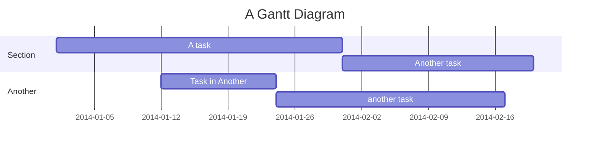
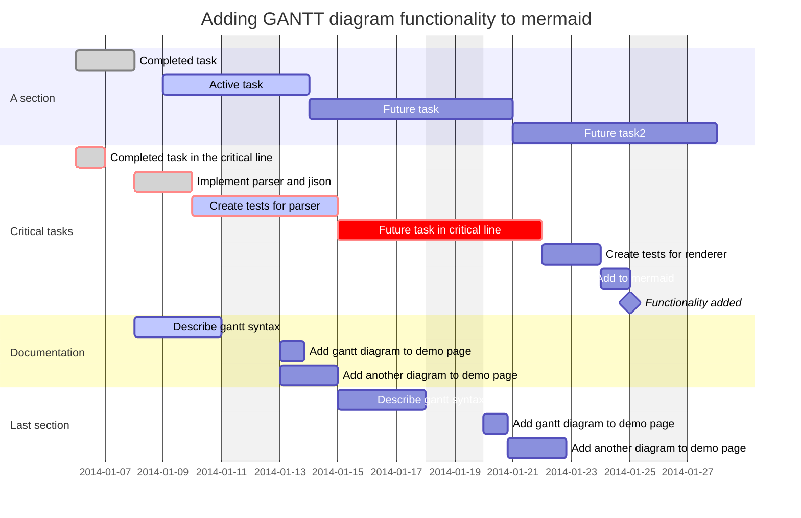
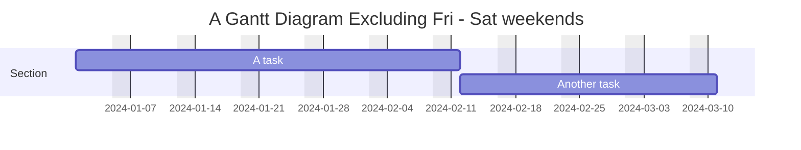
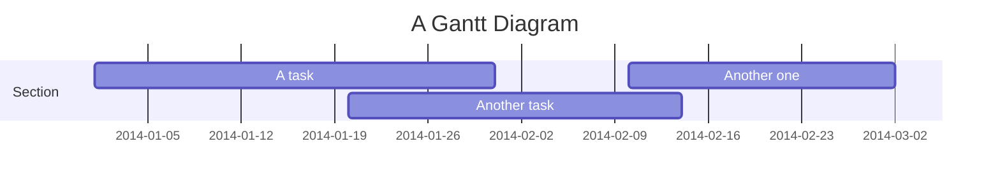

# Gantt Diagrams

> A Gantt chart is a type of bar chart that illustrates a project schedule and the amount of time it would take for any one project to finish. Gantt charts illustrate number of days between the start and finish dates of the terminal elements and summary elements of a project.

## Note to Users

- When dates specific to a task are "excluded", the chart extends the task by an equal number of days to the right (no gap inside the task).
- If excluded dates are between two consecutive tasks, they are skipped graphically and left blank.

## Basic Example



## Syntax



Tasks are by default sequential. A task start date defaults to the end date of the preceding task.

A colon, `:`, separates the task title from its metadata. Metadata items are separated by a comma, `,`. Valid tags are `active`, `done`, `crit`, and `milestone`. Tags are optional, but if used, they must be specified first.

After processing the tags, the remaining metadata items are interpreted as follows:

1. If a single item is specified, it determines when the task ends. It can either be a specific date/time or a duration. If a duration is specified, it is added to the start date of the task.
2. If two items are specified, the last item is interpreted as above. The first item can either specify an explicit start date/time or reference another task using `after <otherTaskID>`.
3. If three items are specified, the last two will be interpreted as above. The first item will denote the ID of the task.

### Task Metadata Reference

| Metadata syntax                                      | Start date                                          | End date                                              | ID       |
| ---------------------------------------------------- | --------------------------------------------------- | ----------------------------------------------------- | -------- |
| `<taskID>, <startDate>, <endDate>`                   | `startdate` as interpreted using `dateformat`       | `endDate` as interpreted using `dateformat`           | `taskID` |
| `<taskID>, <startDate>, <length>`                    | `startdate` as interpreted using `dateformat`       | Start date + `length`                                 | `taskID` |
| `<taskID>, after <otherTaskId>, <endDate>`           | End date of previously specified task `otherTaskID` | `endDate` as interpreted using `dateformat`           | `taskID` |
| `<taskID>, after <otherTaskId>, <length>`            | End date of previously specified task `otherTaskID` | Start date + `length`                                 | `taskID` |
| `<taskID>, <startDate>, until <otherTaskId>`         | `startdate` as interpreted using `dateformat`       | Start date of previously specified task `otherTaskID` | `taskID` |
| `<taskID>, after <otherTaskId>, until <otherTaskId>` | End date of previously specified task `otherTaskID` | Start date of previously specified task `otherTaskID` | `taskID` |
| `<startDate>, <endDate>`                             | `startdate` as interpreted using `dateformat`       | `enddate` as interpreted using `dateformat`           | n/a      |
| `<startDate>, <length>`                              | `startdate` as interpreted using `dateformat`       | Start date + `length`                                 | n/a      |
| `after <otherTaskID>, <endDate>`                     | End date of previously specified task `otherTaskID` | `enddate` as interpreted using `dateformat`           | n/a      |
| `after <otherTaskID>, <length>`                      | End date of previously specified task `otherTaskID` | Start date + `length`                                 | n/a      |
| `<startDate>, until <otherTaskId>`                   | `startdate` as interpreted using `dateformat`       | Start date of previously specified task `otherTaskID` | n/a      |
| `after <otherTaskId>, until <otherTaskId>`           | End date of previously specified task `otherTaskID` | Start date of previously specified task `otherTaskID` | n/a      |
| `<endDate>`                                          | End date of preceding task                          | `enddate` as interpreted using `dateformat`           | n/a      |
| `<length>`                                           | End date of preceding task                          | Start date + `length`                                 | n/a      |
| `until <otherTaskId>`                                | End date of preceding task                          | Start date of previously specified task `otherTaskID` | n/a      |

> Support for keyword `until` was added in v10.9.0+

### Title

The `title` is an _optional_ string to be displayed at the top of the Gantt chart.

### Excludes

The `excludes` is an _optional_ attribute that accepts specific dates in YYYY-MM-DD format, days of the week ("sunday") or "weekends", but not the word "weekdays". These dates will be marked on the graph and excluded from duration calculation.

#### Weekend (v11.0.0+)

When excluding weekends, configure start day with the `weekend` attribute (`friday` or `saturday`). Default is Saturday and Sunday.



### Section Statements

Divide the chart into sections with the `section` keyword followed by a name (required).

### Milestones

Milestones represent a single instant in time. Use the `milestone` tag. Location = _initial date_ + _duration_/2.

```mermaid
gantt
    dateFormat HH:mm
    axisFormat %H:%M
    Initial milestone : milestone, m1, 17:49, 2m
    Task A : 10m
    Task B : 5m
    Final milestone : milestone, m2, 18:08, 4m
```



### Vertical Markers

The `vert` keyword adds vertical reference lines at specific dates (don't take up a row).

```mermaid
gantt
    dateFormat HH:mm
    axisFormat %H:%M
    Initial vert : vert, v1, 17:30, 2m
    Task A : 3m
    Task B : 8m
    Final vert : vert, v2, 17:58, 4m
```



## Setting Dates

### Input Date Format

The default input date format is `YYYY-MM-DD`. You can define your custom `dateFormat`.

| Input      | Example        | Description                                            |
| ---------- | -------------- | ------------------------------------------------------ |
| `YYYY`     | 2014           | 4 digit year                                           |
| `YY`       | 14             | 2 digit year                                           |
| `Q`        | 1..4           | Quarter of year. Sets month to first month in quarter. |
| `M MM`     | 1..12          | Month number                                           |
| `MMM MMMM` | January..Dec   | Month name in locale set by `dayjs.locale()`           |
| `D DD`     | 1..31          | Day of month                                           |
| `Do`       | 1st..31st      | Day of month with ordinal                              |
| `DDD DDDD` | 1..365         | Day of year                                            |
| `X`        | 1410715640.579 | Unix timestamp                                         |
| `x`        | 1410715640579  | Unix ms timestamp                                      |
| `H HH`     | 0..23          | 24 hour time                                           |
| `h hh`     | 1..12          | 12 hour time used with `a A`.                          |
| `a A`      | am pm          | Post or ante meridiem                                  |
| `m mm`     | 0..59          | Minutes                                                |
| `s ss`     | 0..59          | Seconds                                                |
| `S`        | 0..9           | Tenths of a second                                     |
| `SS`       | 0..99          | Hundreds of a second                                   |
| `SSS`      | 0..999         | Thousandths of a second                                |
| `Z ZZ`     | +12:00         | Offset from UTC as +-HH:mm, +-HHmm, or Z              |

More info: <https://day.js.org/docs/en/parse/string-format/>

### Output Date Format on the Axis

The default output date format is `YYYY-MM-DD`. You can define your custom `axisFormat`.

| Format | Definition                                                                                |
| ------ | ----------------------------------------------------------------------------------------- |
| %a     | abbreviated weekday name                                                                  |
| %A     | full weekday name                                                                         |
| %b     | abbreviated month name                                                                    |
| %B     | full month name                                                                           |
| %c     | date and time, as "%a %b %e %H:%M:%S %Y"                                                 |
| %d     | zero-padded day of the month as a decimal number [01,31]                                  |
| %e     | space-padded day of the month as a decimal number [ 1,31]                                 |
| %H     | hour (24-hour clock) as a decimal number [00,23]                                          |
| %I     | hour (12-hour clock) as a decimal number [01,12]                                          |
| %j     | day of the year as a decimal number [001,366]                                             |
| %m     | month as a decimal number [01,12]                                                         |
| %M     | minute as a decimal number [00,59]                                                        |
| %L     | milliseconds as a decimal number [000, 999]                                               |
| %p     | either AM or PM                                                                           |
| %S     | second as a decimal number [00,61]                                                        |
| %U     | week number of the year (Sunday as the first day of the week) as a decimal number [00,53] |
| %w     | weekday as a decimal number [0(Sunday),6]                                                 |
| %W     | week number of the year (Monday as the first day of the week) as a decimal number [00,53] |
| %x     | date, as "%m/%d/%Y"                                                                       |
| %X     | time, as "%H:%M:%S"                                                                       |
| %y     | year without century as a decimal number [00,99]                                          |
| %Y     | year with century as a decimal number                                                     |
| %Z     | time zone offset, such as "-0700"                                                         |
| %%     | a literal "%" character                                                                   |

More info: <https://github.com/d3/d3-time-format/tree/v4.0.0#locale_format>

### Axis Ticks (v10.3.0+)

The default output ticks are auto. You can customize with `tickInterval`, like `1day` or `1week`.

Pattern: `/^([1-9][0-9]*)(millisecond|second|minute|hour|day|week|month)$/`

Week-based `tickInterval`s start on Sunday by default. Use the `weekday` option to change:

```mermaid
gantt
  tickInterval 1week
  weekday monday
```

> `millisecond` and `second` support was added in v10.3.0

## Compact Mode

Display multiple tasks in the same row by setting `displayMode: compact` via YAML frontmatter.



## Comments

Comments need to be on their own line and must be prefaced with `%%` (double percent signs).

## Today Marker

Style it with:

```
todayMarker stroke-width:5px,stroke:#0f0,opacity:0.5
```

Hide it with:

```
todayMarker off
```

## Configuration

```javascript
mermaid.ganttConfig = {
  titleTopMargin: 25,
  barHeight: 20,
  barGap: 4,
  topPadding: 75,
  rightPadding: 75,
  leftPadding: 75,
  gridLineStartPadding: 10,
  fontSize: 12,
  sectionFontSize: 24,
  numberSectionStyles: 1,
  axisFormat: '%d/%m',
  tickInterval: '1week',
  topAxis: true,
  displayMode: 'compact',
  weekday: 'sunday',
};
```

## Interaction

Bind click events to tasks (requires `securityLevel='loose'`):

```
click taskId call callback(arguments)
click taskId href URL
```

## Bar Chart Example (using gantt)

```mermaid
gantt
    title Git Issues - days since last update
    dateFormat X
    axisFormat %s
    section Issue19062
    71   : 0, 71
    section Issue19401
    36   : 0, 36
    section Issue193
    34   : 0, 34
    section Issue7441
    9    : 0, 9
    section Issue1300
    5    : 0, 5
```


