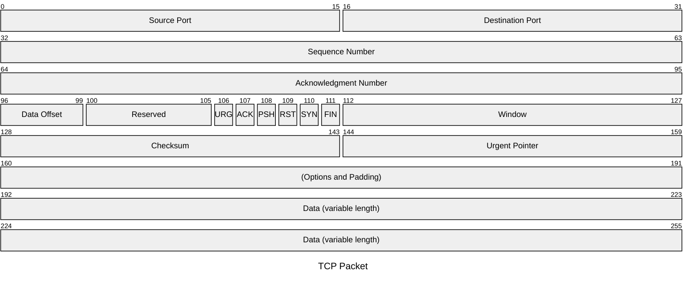
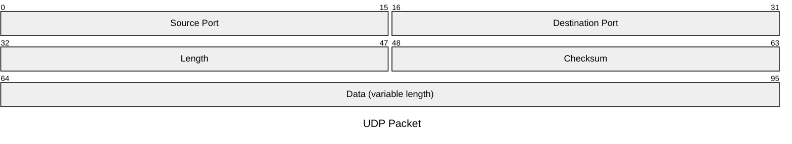

# Packet Diagram (v11.0.0+)

## Introduction

A packet diagram is a visual representation used to illustrate the structure and contents of a network packet. Network packets are the fundamental units of data transferred over a network.

## Usage

This diagram type is particularly useful for developers, network engineers, educators, and students who require a clear and concise way to represent the structure of network packets.

## Syntax

```
packet
start: "Block name" %% Single-bit block
start-end: "Block name" %% Multi-bit blocks
... More Fields ...
```

### Bits Syntax (v11.7.0+)

Using start and end bit counts can be difficult, especially when modifying a design. For this we add a bit count field, which starts from the end of the previous field automagically. Use `+<count>` to set the number of bits, thus:

```
packet
+1: "Block name" %% Single-bit block
+8: "Block name" %% 8-bit block
9-15: "Manually set start and end, it's fine to mix and match"
... More Fields ...
```

## Examples





## Details of Syntax

- **Ranges**: Each line after the title represents a different field in the packet. The range (e.g., `0-15`) indicates the bit positions in the packet.
- **Field Description**: A brief description of what the field represents, enclosed in quotes.
