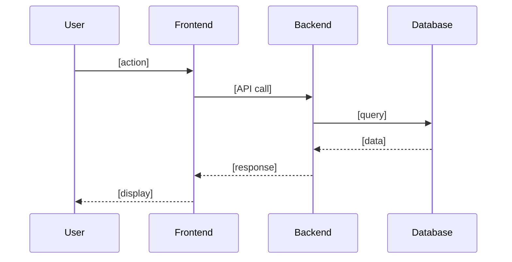

# Technical Note Template

> **Version:** 3.0 | **Updated:** 2025-01-22

---

## Usage

**Naming:** `Technical Note: [Feature Name] (BEP-XXX)`

**Location:** Confluence → Under Epic Doc (child page)

**Owner:** Technical Analyst

**When:** Story มี technical complexity, API changes, หรือ DB schema changes

---

## Template (Copy ไปใช้เลย)

```markdown
# Technical Note: [Feature Name]

> **Story:** [BEP-XXX](https://100-stars.atlassian.net/browse/BEP-XXX)  
> **Epic:** [BEP-YYY](link) - [Epic Name]  
> **Status:** Draft / In Review / Approved  
> **Updated:** YYYY-MM-DD

---

## Overview

[อธิบาย 2-3 ประโยค: ทำอะไร, ทำไม, ใครได้ประโยชน์]

**Story:**
> As a [persona],  
> I want to [action],  
> So that [benefit].

**Services:**
| Service | Affected |
| --- | --- |
| Backend | ✅/❌ |
| Admin | ✅/❌ |
| Website | ✅/❌ |

---

## Flow (ถ้าจำเป็น)



---

## API Specification (ถ้ามี)

### [API Name]

**Endpoint:** `[METHOD] /api/v[X]/[path]`

**Request:**
```json
{
  "field": "value"
}
```

**Response (200):**
```json
{
  "status": "success",
  "data": {}
}
```

**Errors:**
| Code | Message |
| --- | --- |
| 400 | Validation error |
| 404 | Not found |

---

## Database (ถ้ามี schema changes)

### Table: `table_name`

| Column | Type | Description |
| --- | --- | --- |
| id | INT PK | Primary key |
| field | VARCHAR | Description |
| created_at | DATETIME | Created |

---

## Business Logic

### Happy Path
**Given** [precondition]  
**When** [action]  
**Then** [result 1], [result 2]

### Validation
**Given** [invalid input]  
**When** [action]  
**Then** [error handling]

### Business Rules
| Rule | Description |
| --- | --- |
| BR-1 | [Rule] |

---

## Sub-tasks

| Key | Service | Summary | Effort |
| --- | --- | --- | --- |
| [BEP-XXX](link) | [BE] | [Desc] | M |
| [BEP-YYY](link) | [FE-Admin] | [Desc] | S |

**Dependencies:**
```
BEP-XXX (BE) → BEP-YYY (FE-Admin)
```

---

## Links

- 📁 Epic: [Epic Doc](link)
- 🎨 Design: [Figma](link)
- 📋 Jira: [Story](link)

---

_Updated: YYYY-MM-DD_
```

---

## Section Guide

| Section | When |
| --- | --- |
| Overview | ✅ Always |
| Flow | ⚠️ Multi-step หรือ multi-service |
| API Spec | ⚠️ New/modified APIs |
| Database | ⚠️ Schema changes |
| Business Logic | ✅ Always |
| Sub-tasks | ✅ Always |
| Links | ✅ Always |

---

## Variants

**Simple (S-M effort):** Overview + Business Logic + Sub-tasks + Links

**Standard (M-L effort):** + Flow + API/DB (ที่เกี่ยวข้อง)

**Complex (L-XL effort):** Full template + UI States + Testing Notes

---

_For detailed API patterns and examples, see `references/templates.md`_
