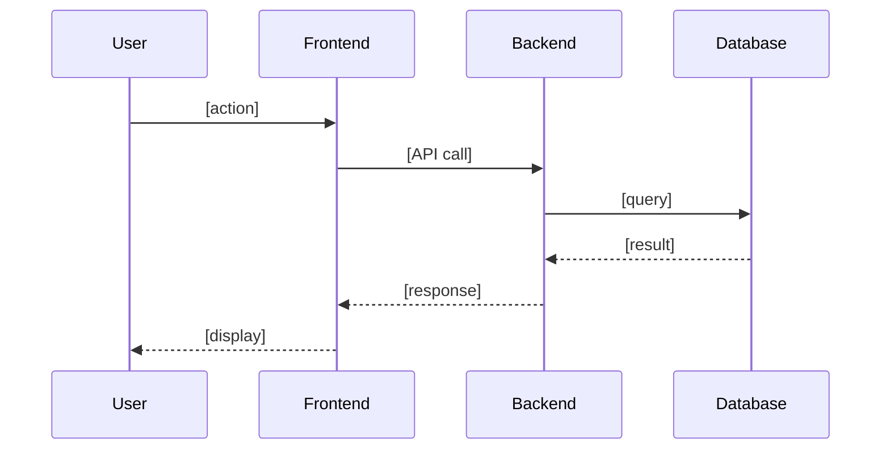
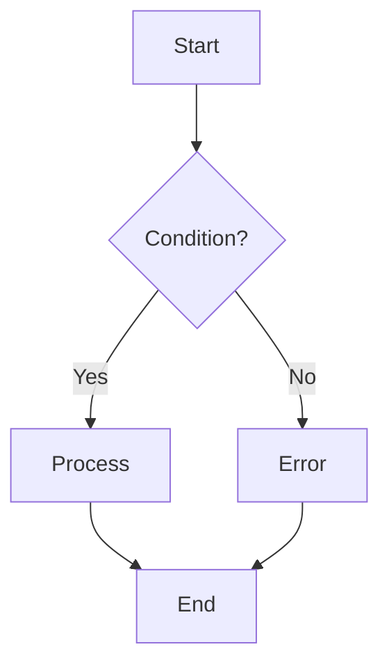

# Templates Reference

> **Purpose:** รวม templates ทั้งหมดสำหรับ PM, PO, TA, QA - โหลดเมื่อต้องการใช้งาน
>
> **Version:** 3.1 | **Updated:** 2026-01-23

---

## 🎨 ADF Cosmetic Guide

### Panel Types (Color-Coded Containers)

| Panel Type | Color | Visual | Use Case |
| :--- | :--- | :---: | :--- |
| `info` | Blue | 🔵 | Story narratives, objectives, general information |
| `success` | Green | 🟢 | Happy path AC, positive test cases |
| `warning` | Yellow | 🟡 | Validation AC, edge cases, warnings |
| `error` | Red | 🔴 | Error handling AC, negative test cases |
| `note` | Purple | 🟣 | Important notes, dependencies, references |

### ADF Panel JSON Structure

```json
{
  "type": "panel",
  "attrs": {"panelType": "success"},
  "content": [
    {
      "type": "paragraph",
      "content": [{"type": "text", "text": "🟢 AC1: Happy Path", "marks": [{"type": "strong"}]}]
    },
    {
      "type": "bulletList",
      "content": [
        {"type": "listItem", "content": [{"type": "paragraph", "content": [{"type": "text", "text": "Given: [context]", "marks": [{"type": "strong"}]}]}]},
        {"type": "listItem", "content": [{"type": "paragraph", "content": [{"type": "text", "text": "When: [action]"}]}]},
        {"type": "listItem", "content": [{"type": "paragraph", "content": [{"type": "text", "text": "Then: [outcome]"}]}]}
      ]
    }
  ]
}
```

### Best Practices

- ✅ Use **success** panels for happy path scenarios
- ✅ Use **warning** panels for validation/edge cases
- ✅ Use **error** panels for error handling scenarios
- ✅ Use **info** panels for context and objectives
- ✅ Use **note** panels for important reminders

---

## 📋 Product Manager Templates

### Epic Description Template

```markdown
## 📖 Overview

[2-3 sentences about what this epic delivers and why]

---

## 🎯 Goals

| # | Goal | Measurable Outcome |
| :---: | :--- | :--- |
| 1 | [Goal description] | [How we measure success] |
| 2 | [Goal description] | [How we measure success] |

---

## 💼 Business Value

| Aspect | Details |
| :--- | :--- |
| **Problem** | [ปัญหาที่แก้] |
| **Solution** | [Solution ที่ทำ] |
| **Impact** | [Expected impact] |
| **Users** | [Who benefits] |

---

## 📊 Success Criteria

| Metric | Current | Target | Status |
| :--- | :---: | :---: | :---: |
| [Metric 1] | [baseline] | [target] | ⬜ |
| [Metric 2] | [baseline] | [target] | ⬜ |

---

## 📋 User Stories

**🚀 MVP (Phase 1)**

| Priority | Story | Status |
| :---: | :--- | :---: |
| 🔴 P0 | [Story 1 title] | ⬜ |
| 🔴 P0 | [Story 2 title] | ⬜ |

---

## ⚠️ Risks & Dependencies

| Risk | Probability | Impact | Mitigation |
| :--- | :---: | :---: | :--- |
| [Risk description] | 🟠 Medium | 🔴 High | [Action] |
```

### RICE Scoring Template

| Feature | Reach | Impact | Confidence | Effort | Score |
| :--- | :---: | :---: | :---: | :---: | :---: |
| [Feature name] | [users/qtr] | [0.25-3] | [0-100%] | [person-weeks] | `R×I×C/E` |

> **Impact Scale:** 🔴 3=Massive | 🟠 2=High | 🟡 1=Medium | 🟢 0.5=Low | ⚪ 0.25=Minimal

---

## 📝 Product Owner Templates

### User Story Template

```markdown
## 📖 User Story

> **As a** [persona],
> **I want to** [action],
> **So that** [benefit].

---

## ✅ Acceptance Criteria

> **AC1: [Happy Path - scenario name]**
>
> | | |
> | --- | --- |
> | **Given** | [precondition] |
> | **When** | [user action] |
> | **Then** | [expected outcome] |

> **AC2: [Validation - scenario name]**
>
> | | |
> | --- | --- |
> | **Given** | [invalid input] |
> | **When** | [user action] |
> | **Then** | [validation message] |

> **AC3: [Error - scenario name]**
>
> | | |
> | --- | --- |
> | **Given** | [error condition] |
> | **When** | [user action] |
> | **Then** | [error handling] |

---

## 🎯 Scope

| Service | Impact | Notes |
| :--- | :---: | :--- |
| 🔧 Backend | ✅ | [note] |
| 🖥️ Admin | ❌ | - |
| 🌐 Website | ✅ | [note] |

---

## 🔗 Links

| Type | Link |
| :--- | :--- |
| 🎨 Design | [Figma URL] |
| 📄 Story Doc | [Confluence URL] |
```

### Sprint Planning Template

```markdown
## Sprint [N] Plan

| Metric | Value |
| :--- | :---: |
| **Capacity** | [X] points |
| **Focus Factor** | 0.85 |
| **Effective** | [X × 0.85] points |

### Committed Stories

| Story | Points | Priority | Status |
| :--- | :---: | :---: | :---: |
| [Story name] | 5 | 🟠 High | ⬜ |
| [Story name] | 3 | 🟡 Medium | ⬜ |
| **Total** | **8** | | |

### Stretch Goals

| Story | Points |
| :--- | :---: |
| [Story name] | 2 |
```

### Backlog Item Template

| ID | Title | Priority | Points | Status |
| :---: | :--- | :---: | :---: | :---: |
| BEP-XXX | [Story title] | 🔴 Critical | 5 | ✅ Ready |
| BEP-XXX | [Story title] | 🟠 High | 3 | ⏳ Refining |
| BEP-XXX | [Story title] | 🟡 Medium | 2 | ⬜ Pending |

---

## 🔧 Technical Analyst Templates

### Sub-task Template

```markdown
## 📖 Story Narrative

> **As a** [persona],
> **I want to** [action],
> **So that** [benefit].

---

## 🎯 Objective

[What and why - 1-2 sentences]

---

## 📁 Scope

| Category | Details |
| :--- | :--- |
| **Files** | `path/to/file1.ts`, `path/to/file2.ts` |
| **Dependencies** | [Related components] |
| **Database** | [Tables affected] |

---

## 📋 Requirements

- [Requirement 1]
- [Requirement 2]

---

## ✅ Acceptance Criteria

> **AC1: [Happy Path]**
>
> | | |
> | --- | --- |
> | **Given** | [precondition] |
> | **When** | [action/API call] |
> | **Then** | [expected response] |

> **AC2: [Error Handling]**
>
> | | |
> | --- | --- |
> | **Given** | [error condition] |
> | **When** | [action/API call] |
> | **Then** | [error response] |

---

## 💡 Notes

- [Edge case to handle]
- [Pattern to follow]

---

## 🔗 Reference

| Type | Link |
| :--- | :--- |
| 📄 User Story | [BEP-XXX](link) |
| 📝 Technical Doc | [Confluence URL] |
```

### Impact Analysis Template

```markdown
## Impact Analysis: [Feature]

### Services Affected

| Service | Impact | Changes |
| :--- | :---: | :--- |
| 🔧 **[BE]** | 🔴 High | [description] |
| 🖥️ **[FE-Admin]** | 🟡 Medium | [description] |
| 🌐 **[FE-Web]** | 🟢 Low | [description] |

### Database Changes

- [ ] New tables: [list]
- [ ] New columns: [list]
- [ ] Migrations: Yes/No

### API Changes

| Endpoint | Change | Breaking? |
| :--- | :---: | :---: |
| `POST /api/xxx` | ✨ New | ❌ No |
| `PUT /api/xxx` | 🔄 Modified | ⚠️ Yes |

### Risks

| Risk | Probability | Impact | Mitigation |
| :--- | :---: | :---: | :--- |
| [risk] | 🟠 Medium | 🔴 High | [action] |
```

---

## 📊 Mermaid Diagram Templates

### Sequence Diagram



### Flowchart



---

## 🧪 QA Analyst Templates

### Test Case Template (Jira Sub-task)

```markdown
## 📖 Story Narrative

> **As a** [persona],
> **I want to** [action],
> **So that** [benefit].

---

## 🎯 Test Objective

[What this test validates]

---

## 📊 AC Coverage

| # | Acceptance Criteria | Scenarios | Status |
| :---: | :--- | :---: | :---: |
| 1 | [AC description] | TC1, TC2 | ✅ |
| 2 | [AC description] | TC3 | ✅ |

> 📈 **Coverage:** [X] scenarios → [Y] ACs (100%)

---

## 🧪 Test Scenarios

| ID | Scenario | AC | Type |
| :---: | :--- | :---: | :---: |
| 🟠 TC1 | [Happy path] | 1 | ✅ Happy |
| 🟠 TC2 | [Error case] | 2 | ❌ Error |

> **Priority:** 🔴 Critical | 🟠 High | 🟡 Medium | 🟢 Low

---

## 📝 Test Cases

> **✅ TC1: [Happy Path Scenario]**
>
> | | |
> | --- | --- |
> | **AC** | 1 |
> | **Priority** | 🟠 High |
> | **Given** | [preconditions] |
> | **When** | [action steps] |
> | **Then** | [expected result] |

> **❌ TC2: [Error Handling]**
>
> | | |
> | --- | --- |
> | **AC** | 2 |
> | **Priority** | 🟠 High |
> | **Given** | [error condition] |
> | **When** | [action] |
> | **Then** | [error response] |

---

## 📦 Test Data

| Data | Description | Source |
| :--- | :--- | :---: |
| [data type] | [description] | 🌱 Seed |
| [data type] | [description] | 🔧 Manual |

---

## 🔗 Reference

| Type | Link |
| :--- | :--- |
| 📋 User Story | [BEP-XXX](link) |
| 📄 Test Plan | [Confluence URL] |
```

### Test Plan Template (Confluence)

```markdown
# Test Plan: [Feature Name]

> **Story:** BEP-XXX
> **Status:** Draft / Ready

## Test Scope

| In Scope | Out of Scope |
| :--- | :--- |
| [area to test] | [excluded] |

## AC Coverage Matrix

| # | Acceptance Criteria | Scenarios | Status |
| :---: | :--- | :---: | :---: |
| 1 | [AC description] | TC1, TC2 | ✅ |
| 2 | [AC description] | TC3 | ✅ |

> 📈 **Coverage:** [X] scenarios → [Y] ACs (100%)

## Test Scenarios

### ✅ Happy Path

| ID | Scenario | AC |
| :---: | :--- | :---: |
| 🟠 TC1 | [scenario] | 1 |

### ❌ Error Cases

| ID | Scenario | AC |
| :---: | :--- | :---: |
| 🟠 TC2 | [scenario] | 2 |

## Test Data Requirements

| Data | Description | Source |
| :--- | :--- | :---: |
| [data] | [description] | 🌱 Seed |

## Links

| Type | Link |
| :--- | :--- |
| 📋 Story | [BEP-XXX](link) |
| 📝 Technical Note | [Confluence URL] |
```

---

## 🏷️ Quick Reference

### Priority Colors

| Level | Icon | When to Use |
| :--- | :---: | :--- |
| **Critical** | 🔴 | Blocker, production, security |
| **High** | 🟠 | Core feature, deadline |
| **Medium** | 🟡 | Standard work |
| **Low** | 🟢 | Nice-to-have |

### Status Icons

| Status | Icon |
| :--- | :---: |
| Pending | ⬜ |
| In Progress | ⏳ |
| Done | ✅ |
| Blocked | 🚫 |

### Test Type Icons

| Type | Icon |
| :--- | :---: |
| Happy Path | ✅ |
| Error | ❌ |
| Edge/Validation | ⚠️ |
| Security | 🔒 |
| UI | 📱 |

### Service Tags

| Service | Tag | Icon |
| :--- | :--- | :---: |
| Backend | `[BE]` | 🔧 |
| Admin | `[FE-Admin]` | 🖥️ |
| Website | `[FE-Web]` | 🌐 |
| QA | `[QA]` | 🧪 |

### Data Source Icons

| Source | Icon |
| :--- | :---: |
| Seed data | 🌱 |
| Manual | 🔧 |
| API | 🔌 |
