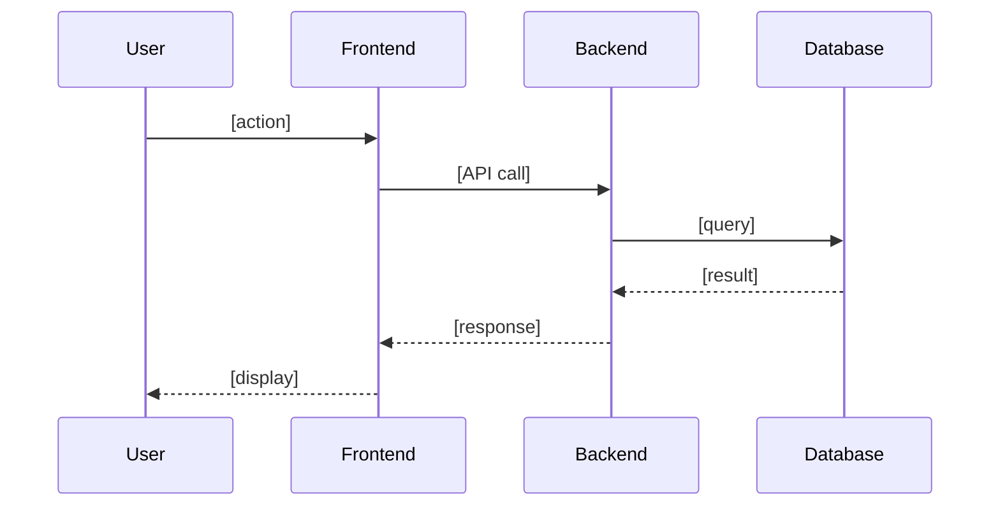
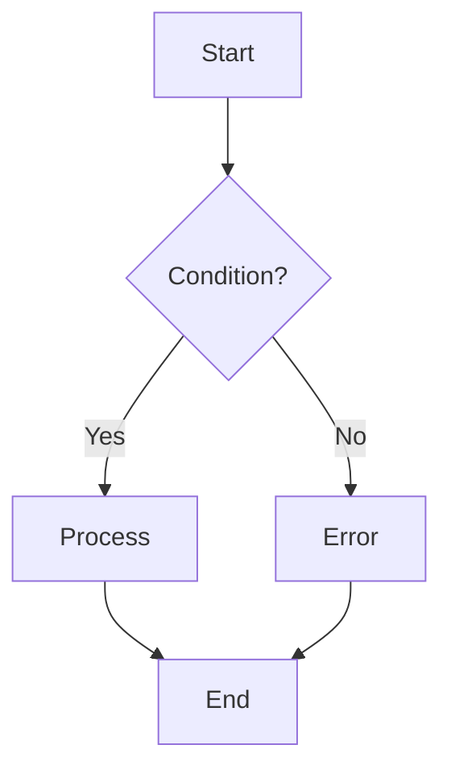
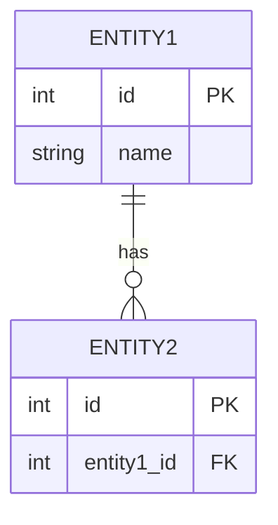

# Templates Reference

> **Purpose:** รวม templates ทั้งหมดสำหรับ PM, PO, TA, QA - โหลดเมื่อต้องการใช้งาน

---

## Product Manager Templates

### Epic Description Template

```markdown
## Overview
[2-3 sentences about what this epic delivers]

## Goals
- [Goal 1]
- [Goal 2]

## Business Value
**Impact:** [High/Medium/Low]
**Revenue:** [Direct/Indirect/None]
**Users:** [Who benefits]

## Success Criteria
- [ ] [Measurable outcome 1]
- [ ] [Measurable outcome 2]

## User Stories
- [ ] [Story 1 title]
- [ ] [Story 2 title]

## Risks & Dependencies
| Risk | Probability | Impact | Mitigation |
| --- | --- | --- | --- |
| [Risk] | H/M/L | H/M/L | [Action] |
```

### RICE Scoring Template

| Feature | Reach | Impact | Confidence | Effort | Score |
| --- | --- | --- | --- | --- | --- |
| [Feature] | [users/qtr] | [0.25-3] | [0-100%] | [person-weeks] | `R×I×C/E` |

**Impact Scale:** 3=Massive, 2=High, 1=Medium, 0.5=Low, 0.25=Minimal

### PRD Template (Brief)

```markdown
# [Feature Name] PRD

## Problem
[What problem are we solving?]

## Solution
[How do we solve it?]

## Success Metrics
- [Metric 1]: [Target]
- [Metric 2]: [Target]

## Scope
**In:** [What's included]
**Out:** [What's not included]

## User Stories
1. [Story 1]
2. [Story 2]
```

---

## Product Owner Templates

### User Story Template

```markdown
**Title:** [Brief description]

### Story
As a [persona],
I want to [action]
so that [benefit]

### Acceptance Criteria

> **✅ AC1: [Happy path scenario name]**
> - **Given** [precondition/context]
> - **When** [user action]
> - **Then** [expected outcome]

> **⚠️ AC2: [Edge case/validation scenario name]**
> - **Given** [edge case condition]
> - **When** [user action]
> - **Then** [expected behavior]

> **❌ AC3: [Error handling scenario name]**
> - **Given** [error condition]
> - **When** [user action]
> - **Then** [error response/message]

### Notes
- [Additional context]

### Story Points: [1/2/3/5/8/13]
```

### Sprint Planning Template

```markdown
## Sprint [N] Plan

**Capacity:** [X] points
**Focus Factor:** 0.85
**Effective Capacity:** [X × 0.85] points

### Committed Stories
| Story | Points | Priority |
| --- | --- | --- |
| [Story] | [pts] | [H/M/L] |
| **Total** | [sum] | |

### Stretch Goals
| Story | Points |
| --- | --- |
| [Story] | [pts] |
```

### Backlog Item Template

```markdown
| ID | Title | Priority | Points | Status |
| --- | --- | --- | --- | --- |
| BEP-XXX | [Title] | [Critical/High/Medium/Low] | [1-13] | [Ready/Needs refinement] |
```

---

## Technical Analyst Templates

### Sub-task Template

```markdown
**Title:** `[TAG] - Brief description`

### Story Narrative
As a [persona], I want to [action] so that [benefit]

### Objective
[What and why - concise]

### Scope
- **Files:** [affected files]
- **Dependencies:** [related components]

### Requirements
[Key requirements - not implementation]

### Acceptance Criteria

> **✅ AC1: [Happy path scenario name]**
> - **Given** [precondition/context]
> - **When** [action/API call]
> - **Then** [expected outcome/response]

> **❌ AC2: [Error handling scenario name]**
> - **Given** [error condition]
> - **When** [action/API call]
> - **Then** [error response/status code]

### Notes
[Edge cases, considerations]

### Priority: [Critical/High/Medium/Low]
### Effort: [S/M/L]
```

### Domain Analysis Template

```markdown
## Domain Analysis: [Feature]

### Events (🟧)
- [Event] - [when it occurs]

### Commands (🟦)
- [Command] → triggers [Event]

### Actors (🟨)
- [Actor]: can [Commands]

### Aggregates
- [Entity]: [related events]
```

### Impact Analysis Template

```markdown
## Impact Analysis: [Feature]

### Services Affected
| Service | Impact | Changes |
| --- | --- | --- |
| [BE] | H/M/L | [desc] |
| [FE-Admin] | H/M/L | [desc] |
| [FE-Web] | H/M/L | [desc] |

### Database Changes
- [ ] New tables: [list]
- [ ] New columns: [list]
- [ ] Migrations: Yes/No

### API Changes
| Endpoint | Change | Breaking? |
| --- | --- | --- |
| [endpoint] | [type] | Yes/No |

### Risks
| Risk | Prob | Impact | Mitigation |
| --- | --- | --- | --- |
| [risk] | H/M/L | H/M/L | [action] |
```

---

## Mermaid Diagram Templates

### Sequence Diagram



### Flowchart



### ER Diagram



---

## QA Analyst Templates

### Test Case Template (Jira Sub-task)

```markdown
**Title:** `[QA] - Test: [brief description]`

### Story Narrative
As a [persona], I want to [action] so that [benefit]

### Test Objective
[What this test validates]

### Related AC
- AC[X]: [copy from User Story]

### Test Scenarios
| ID | Scenario | Type | Priority |
| --- | --- | --- | --- |
| TC1 | [scenario] | Happy | High |
| TC2 | [scenario] | Error | Medium |

### Test Steps
**TC1: [Scenario Name]**
Preconditions: [setup]
Steps:
1. [step 1]
2. [step 2]
Expected: [result]

### Priority: [Critical/High/Medium/Low]
### Effort: [S/M]
```

### Test Plan Template (Confluence)

```markdown
# Test Plan: [Feature Name]

> **Story:** BEP-XXX
> **Status:** Draft / Ready

## Test Scope
- In: [areas to test]
- Out: [excluded]

## AC Coverage Matrix
| AC | Description | Test Cases | Priority |
| --- | --- | --- | --- |
| AC1 | [desc] | TC1, TC2 | High |

## Test Scenarios
### Happy Path
| ID | Scenario | AC |
| TC1 | [scenario] | AC1 |

### Error Cases
| ID | Scenario | AC |
| TC2 | [scenario] | AC2 |

## Test Data Requirements
| Data | Source |
| [data] | [source] |

## Links
- Story: [link]
- Technical Note: [link]
```

### Coverage Matrix Template

| AC | Description | Test Cases | Status |
| --- | --- | --- | --- |
| AC1 | [desc] | TC1, TC2 | ⬜/✅ |
| AC2 | [desc] | TC3 | ⬜/✅ |

**Coverage:** [X] test cases / [Y] ACs
